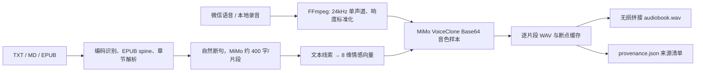

# 技术设计：授权声音的情感小说朗读

## 一、目标与边界

输入是一段 3–120 秒、已获声音本人授权的日常语音，以及 TXT / Markdown / EPUB 小说；输出为带逐句情感变化的本地 WAV 有声书和可审计的生成清单。

当前版本定位为**单用户本地应用**。它不会抓取微信数据，而是接收微信导出或用户主动选择的音频文件。浏览器无法直接解析微信私有 SILK 编码，因此原生 `.silk` 需先在本机转换为标准音频。未经授权的第三方声音、公众人物冒充、远程多人服务不在范围内。

## 二、核心选型

### 主引擎：MiMo V2.5 TTS VoiceClone

选择理由：

1. `mimo-v2.5-tts-voiceclone` 直接接收 WAV/MP3 音频样本，无需本地下载模型；
2. 支持通过自然语言指令控制情感、语速、角色和停顿；
3. 返回标准 WAV，能直接接入现有的分片缓存、拼接和网页播放器；
4. API Key 可由网页注入内存，项目和磁盘不保存密钥；
5. 可在普通电脑运行，不依赖本地 CUDA 环境。

官方接口与模型说明：<https://mimo.mi.com/docs/en-US/quick-start/usage-guide/audio/speech-synthesis-v2.5>。调用时参考语音和小说分段会发送到小米服务，用户应在上传前理解并接受这一数据边界。

备选是本地 IndexTTS2，适合不能把声音发送到云端的环境；现有 `IndexTTS2Synthesizer` 仍然保留。

## 三、端到端数据流

### 音频前处理

`app/audio.py` 通过 FFmpeg 做高通、低通与 EBU 风格响度归一化，统一为模型稳定的 24 kHz / mono / 16-bit PCM。长度下限防止音色信息不足，上限避免用户误传整段节目。建议素材仍是 10–30 秒、单人、无背景音乐。

### 长文本处理

`app/text.py` 支持 UTF-8、GBK/GB18030 等常见中文编码。EPUB 优先读取 `container.xml → OPF manifest → spine`，按出版物声明的阅读顺序抽取正文。章节识别后按句末标点切分，超长句再在逗号、冒号等位置降级切分。

### 情感策略

`app/emotion.py` 采用可解释、确定性的文本线索生成 `[happy, angry, sad, afraid, disgusted, melancholic, surprised, calm]`。叙述默认保留平静分量；对白、叹号、疑问号和情绪词提升主情感。用户强度乘子限制在 0–1，默认 0.65。确定性策略便于测试和复现；后续可以把这一层替换为小型分类器或大语言模型，但不应让大模型直接生成音频。

### 推理与恢复

`app/synth.py` 是引擎抽象。`MiMoVoiceCloneSynthesizer` 把情感向量转换为中文演播指令，将参考 WAV 作为 Base64 音色样本调用官方 OpenAI 兼容接口，并校验返回内容确实为 WAV。MiMo 请求默认绕过系统代理直连；对响应截断、连接重置、超时、429 和 5xx 使用指数退避重试。每个片段以序号落盘；同一任务失败后可从断点继续，已有 WAV 不重复计算。`MockSynthesizer` 只用于自动化测试，正常服务会拒绝用它创建任务。

### 存储与来源

所有数据位于 `data/{voices,books,jobs}`。元数据用临时文件 + `os.replace` 原子更新，避免进程中断留下半写 JSON。每部作品包含 `provenance.json`，记录合成引擎、授权确认、声音/小说 ID、逐片段文本与情感向量。它不是不可移除的水印，但为个人本地工作流提供可审计来源。

## 四、接口与并发

- FastAPI 提供上传、资源库、创建任务、进度和下载接口；静态前端不依赖构建工具。
- 单进程 `ThreadPoolExecutor(max_workers=1)` 避免并发 API 调用耗尽配额，并保持片段顺序。
- 浏览器每 2 秒轮询活动任务；完成后直接播放/下载 WAV。
- 单文件默认限制 200 MB。生产部署还需反向代理级别的请求体限制和超时。

## 五、测试策略与结果

| 层级 | 已覆盖内容 | 结果 |
|---|---|---|
| 单元 | 章节、断句、顺序、情感语义、向量归一化 | 通过 |
| 安全 | 未勾选本人授权时拒绝保存声音 | 通过 |
| 服务 E2E | WAV 参考音 + 两章小说 → 队列 → 分片 → 拼接 → 来源记录 | 通过 |
| HTTP E2E | 上传声音、上传小说、创建任务、查询、下载 WAV | 通过 |
| MiMo 合约 | Base64 音色、角色消息、情感指令、API 头、WAV 解码 | 通过 |
| UI | 桌面三栏、表单可访问性、引擎状态、390×844 响应式与无横向溢出 | 通过 |
| 真实模型声学 | 需用户提供获授权真人语音并下载模型权重 | 待素材 |

自动化执行结果以仓库最新测试为准。真实声学测试不能用模拟响应代替；上线门槛建议自然度、音色相似度、情感匹配度盲听 MOS 均值不低于 3.8，普通叙述 ASR 回转录 CER 不高于 8%。

## 六、部署与生产化

个人使用只监听 `127.0.0.1`。若扩展成多人产品，至少增加：身份认证、每用户加密密钥、声音授权凭证及撤回/删除流程、任务配额、显式 AI 合成标志、防公众人物冒充策略、审计日志、对象存储生命周期、内容版权确认，以及模型许可证和当地法律审查。
