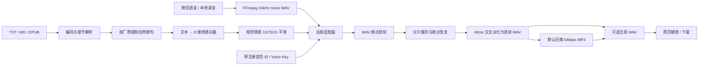

# 技术设计：多厂商远程声音复刻小说朗读

## 一、目标与边界

输入是一段已获本人授权的日常语音和 TXT / Markdown / EPUB 小说；输出是分片生成、可恢复、可在线播放和下载的有声书，默认 MP3，也可选择无损 WAV。

本版本只调用远程 API，不加载本地 TTS 权重。服务运行在用户电脑上，但参考语音、小说分片和情感参数会按所选协议发送到远程 URL。凭据只保存在内存。

系统不承诺“完美复刻”。它保证的是：

1. 不把测试音或预置音色标成克隆音色；
2. 严格按厂商公开协议传递音色 ID、参考音和情感参数；
3. 对厂商权限、白名单、同意录音和预注册流程给出明确提示；
4. 对返回结果执行 WAV 校验，避免杂乱字节进入拼接链路。

## 二、适配器结构

`app/synth.py` 提供统一 `Synthesizer.synthesize(reference, text, emotion, output)` 接口：

- `MiMoVoiceCloneSynthesizer`：参考 WAV Base64 随请求发送，情感向量转中文演播指令。
- `RemoteProviderSynthesizer`：按 `protocol` 构建阿里、腾讯、百度、Google、OpenAI 或 IndexTTS URL 请求。
- `MockSynthesizer`：仅用于测试；默认禁止创建正式任务。

### 厂商协议映射

| protocol | 请求 | 音频响应 | 情感 |
|---|---|---|---|
| `aliyun-cosyvoice` | Bearer JSON `SpeechSynthesizer` | JSON 音频 URL → WAV | `instruction` |
| `tencent-tts` | TC3-HMAC-SHA256 `TextToVoice` | `Response.Audio` Base64 WAV | Category + Intensity |
| `baidu-voice-clone` | Authorization JSON | 二进制 WAV | emotion 枚举 |
| `google-cloud-tts` | OAuth Bearer + Project ID | `audioContent` Base64 LINEAR16/WAV | 文本韵律；无统一 emotion 枚举 |
| `openai-tts` | Bearer `POST /audio/speech` | 二进制 WAV | `instructions` |
| `indextts-url` | multipart 参考 WAV + 正文 + 8 维向量 | WAV、Base64 或 URL | 原生 `emo_vector` |

阿里、腾讯、百度、Google、OpenAI 的合成阶段使用已经创建的音色 ID / cloning key。音色注册接口在鉴权、计费、审核、规定同意语句和异步状态上差异很大，因此不在“应用配置”动作中静默创建收费音色。

## 三、数据流



### 情感映射

内部向量顺序为：

```text
[happy, angry, sad, afraid, disgusted, melancholic, surprised, calm]
```

- 小米、阿里、OpenAI：转换为自然语言演播 instruction。
- 腾讯：映射为 `happy/angry/sad/fear/disgusted/amaze/peaceful`，强度转换到 50–200。
- 百度：映射为 `happy/angry/down/fear/disgust/surprise`。
- Google：保留标点和文本节奏；Instant Custom Voice 没有通用情绪枚举。
- IndexTTS：直接提交完整 8 维向量。

映射只使用厂商支持的控制面。若具体音色不支持情绪字段，厂商可能忽略或拒绝该参数，不能把这种结果描述为完美情感复刻。

## 四、稳定性

- 每个厂商有独立单片长度：腾讯 140 字，阿里/百度 450 字，IndexTTS 150 字。
- HTTP 429、5xx、超时、连接重置和 `IncompleteRead` 最多重试 3 次。
- 单线程队列避免同时消耗多个厂商配额，并保证章节顺序。
- 每个成功片段立即落盘；任务失败后可从已有片段继续。
- 所有适配器输出进入统一 RIFF/WAVE 校验，不接受 HTML、JSON 错误页或 MP3 冒充 WAV。
- 全部片段先做邻接情感平滑，再逐段生成；MiMo 温度固定为 0.25，所有指令要求音量、音高、语速与叙述者状态连续。
- 最终合并用 40ms 线性交叉淡化替代固定静音；默认转为 24 kHz 单声道 64 kbps MP3，成功后删除临时 WAV 分片。
- 完成作品由 `/audio` 内嵌播放，`/download` 作为附件下载。

## 五、安全与隐私

- 上传声音前必须勾选授权确认。
- SecretKey、API Key、OAuth Token 和 Voice Key 不写入 metadata、日志或健康接口。
- API URL 禁止嵌入用户名、密码和 fragment。
- `data/`、`.env`、音频、小说和模型文件被 Git 忽略。
- Google / OpenAI 自定义声音需要厂商规定的 consent recording；应用不会绕过。
- 公网或多人部署必须再增加登录、加密密钥存储、配额、审计、音色撤回、AI 合成标识和滥用检测。

## 六、测试

| 层级 | 覆盖 |
|---|---|
| 文本与情感 | 章节、断句、顺序、8 维归一化 |
| 音频管线 | 标准化、情感邻接平滑、交叉淡化、MP3/WAV 输出、来源记录 |
| HTTP E2E | 上传、任务、进度、播放、下载、取消、重试、删除 |
| 小米 | 自定义 URL/模型/鉴权、响应截断重试 |
| 阿里 | JSON 合约、instruction、音频 URL 下载 |
| 腾讯 | TC3 签名、FastVoiceType、情感参数、Base64 |
| 百度 | voice_id、emotion、二进制 WAV |
| Google | Project ID、OAuth、cloning key、Base64 |
| OpenAI | custom voice 对象、instructions、WAV |
| IndexTTS | multipart 参考音、8 维向量、三种响应形式 |

合同测试不等于真实声学验收。真实验收需要有效账号、已授权音色和计费权限，并应分别测量自然度、音色相似度、情感匹配度和 ASR CER。
